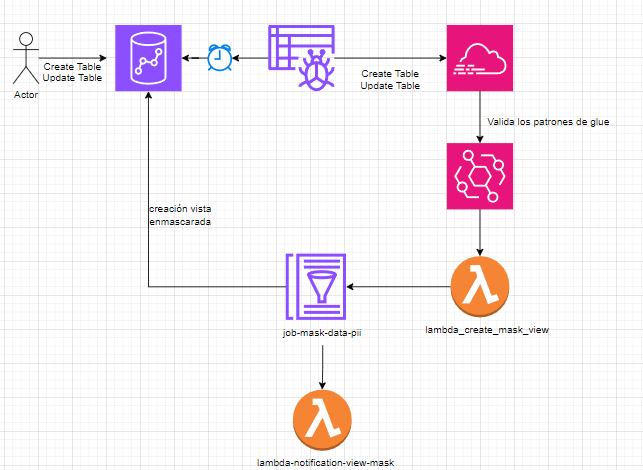

# Aplicación Serverless con AWS y Terraform

¡Bienvenido a este proyecto serverless! Este repositorio contiene una solución backend de detección y enmascaramiento de datos PII. Usando una arquitectura impulsada por eventos con servicios serverless.

## Tabla de Contenidos

1. [Descripción General](#descripción-general)
2. [Arquitectura](#arquitectura)
3. [Requisitos Previos](#requisitos-previos)
4. [Instrucciones de Configuración](#instrucciones-de-configuración)
5. [Pruebas de la Aplicación](#pruebas-de-la-aplicación)
6. [Contribuciones](#contribuciones)

---

## Descripción General

Este proyecto demuestra una arquitectura serverless utilizando los servicios de AWS, incluyendo:

- **AWS Lambda**:    Lógica del backend, inicialización ejecución de trabajo en glue y posterior notificación ante la creación de la vista enmascarada.
- **AWS Glue**:      Detección a partir de patrones data pii y creación de vistas enmascaradas.
- **Crawler Glue**:  Detección de cambios sobre las tablas de redshift.Ejecución 
- **Event Bridge**:  Productor de eventos para el desencadenar el procesamiento de la data.
- **Redshift**:      Almacen de datos.
- **CloudTrail**:    Centraliza las llamadas a las api y registra los cambios detectados sobre los crawler.

El flujo de la solción consta de lo siguientes pasos.

1. Usuario realiza operaciones DML tales como Create Table/ Update Table sobre las tablas en los esquemas de redshift.
2. En un horario programado se realiza la llamada para que el crawler detecte los cambios sobre dichas tablas.
3. Dichos cambios son registrados en cloud trail.
4. El event bridge esta a la escucha de dichos eventos y ejecuta un desencadenamiento sobre la lambda.
6. La lambda realiza la invocación del job de glue , encargado de descubrir los patrones de data pii y generar una vista enmascarada, donde evalua los permisos que tiene el usario sobre dicha vista y entrega la información en limpio o enmascarada.
7. Al culminar la creación de la vista se notifica al usuario administrador la creación o actualización de la vista.

Está diseñado para ser implementado fácilmente utilizando Terraform, lo que permite un aprovisionamiento consistente de la infraestructura.

## Arquitectura




## Requisitos Previos

Antes de desplegar el proyecto, asegúrate de tener lo siguiente:

- [Terraform](https://www.terraform.io/downloads.html) instalado.
- AWS CLI instalado y configurado con los permisos adecuados de IAM.
- Una cuenta de AWS.

## Instrucciones de Configuración

Sigue estos pasos para desplegar el proyecto:

1. **Clona el repositorio**:
   ```bash
   git clone https://github.com/AndersonD93/data_mask_pii_aws.git
   cd terraform
   ```

2. **Inicializa Terraform usando el backend local**:
   Comenta el bloque `backend` en el archivo `main.tf` y ejecuta los siguientes comandos para aprovisionar los recursos iniciales:
   ```bash
   terraform init
   terraform plan
   terraform apply
   ```

5. **Configura el backend remoto en Terraform(Opcional)**:
   Descomenta el bloque `backend` en el archivo `main.tf`(Opcional si quieres manejar tu backend en forma remota):
   ```hcl
   terraform {
       backend "s3" {
           bucket         = "mi-bucket-unico-para-tf-state"
           key            = "tf-infra/terraform.tfstate"
           region         = "us-east-1"
           encrypt        = true
           dynamodb_table = "terraform-state-locking-ajduran2"
       }
   }
   ```
   Además, modifica la línea bucket_name dentro del módulo tf-state en main.tf para que coincida con el nombre del bucket configurado:

   ```hcl
      module "tf-state" {
      source      = "./modules/tf-state"
      bucket_name = "mi-bucket-unico-para-tf-state"
   }
   ```
   Luego, vuelve a inicializar y aplica los cambios:
   ```bash
   terraform init
   terraform apply
   ```

6. **Despliega la infraestructura**:
   ```bash
   terraform apply
   ```
   Confirma los cambios escribiendo `yes` cuando se te solicite.


## Pruebas de la Aplicación

1. Inserta nuevos datos sobre el redshift.
2. Ejecuta el crawler de forma manual.
3. Ingresa a la bd con el usuario creado en el setup.sql con permisos en false. (Visualizando la información enmascarada)
4. Cambia dichos permisos a true. (Visualizaras la información en limpio)

## Contribuciones

¡Las contribuciones son bienvenidas! Aquí tienes cómo puedes ayudar:

1. **Reporta Problemas**: Usa la pestaña Issues para reportar errores o sugerir funcionalidades.
2. **Haz un Fork del Repositorio**: Realiza tus cambios y crea un pull request.
3. **Propón Ideas**: Comparte tus ideas para mejorar el proyecto en la pestaña Discussions.

### Directrices

- Asegúrate de documentar los cambios realizados en el código.
- Sigue el estilo y la estructura del código existente.
- Incluye pruebas para cualquier nueva funcionalidad.

---

¡No dudes en contactarme si tienes preguntas o comentarios! Construyamos algo increíble juntos 🚀.
